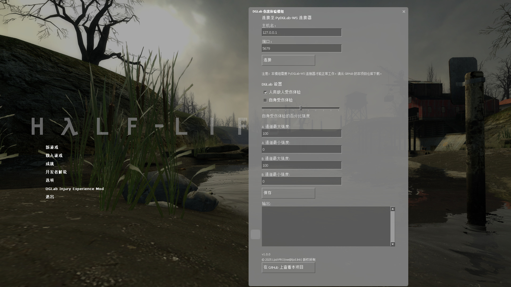
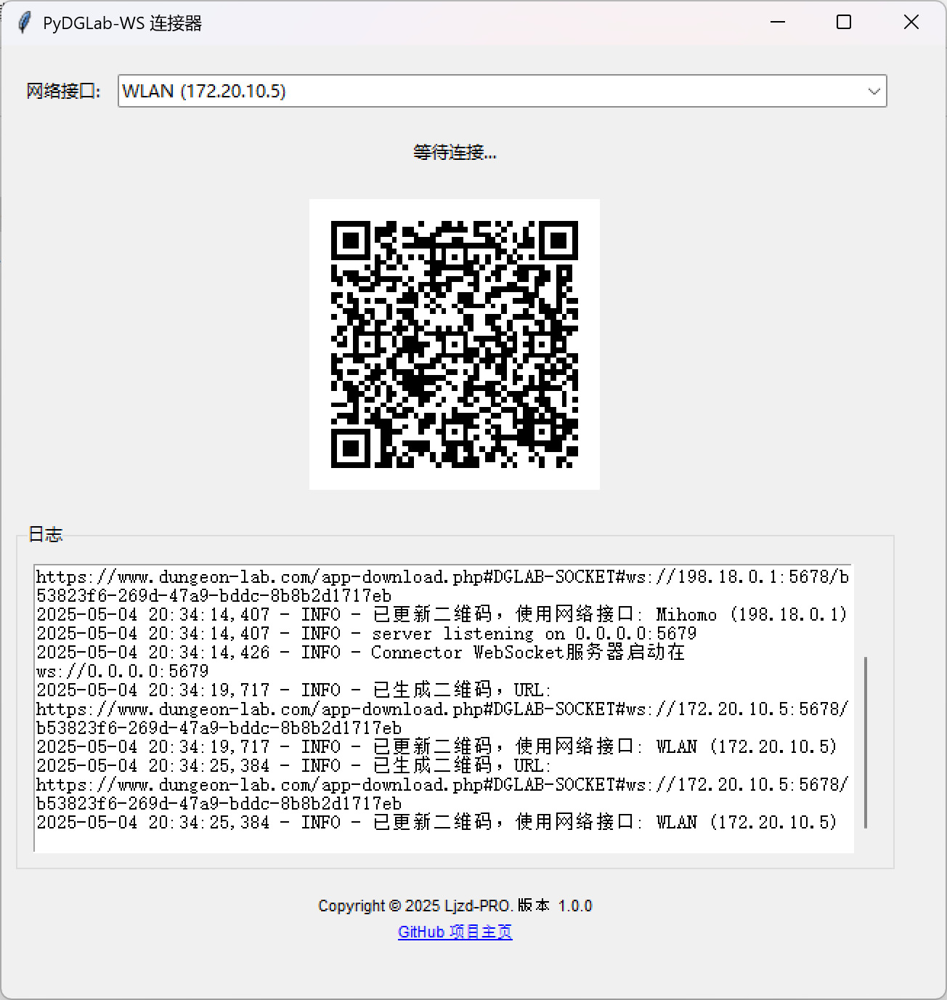
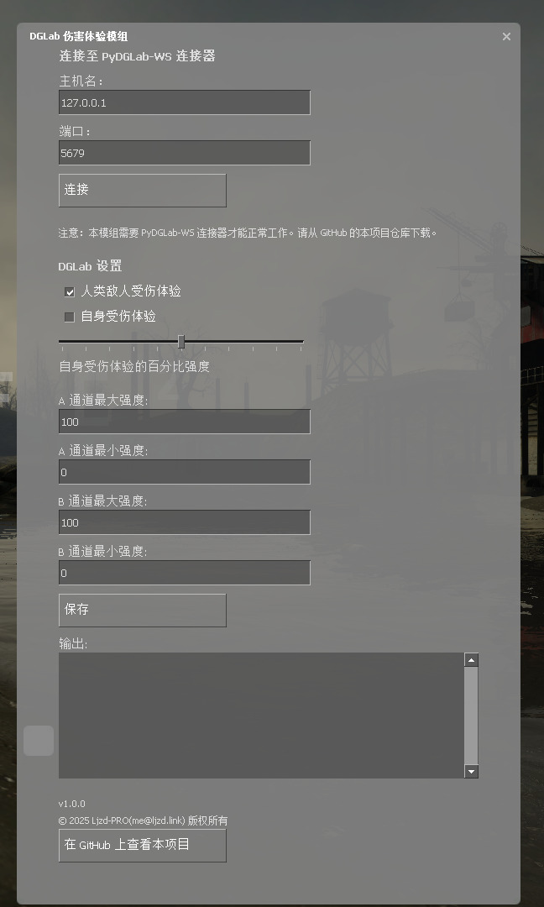

# DGLab Injury Experience Mod

半条命 2 Mod —— 用郊狼⚡模拟一下自己和敌人的受伤痛觉~



## 使用说明

> 本 Mod 需要与一个中转程序（PyDGLab-WS 连接器）配合使用，以实现与郊狼 DG-Lab App 的连接。

1. 安装 Mod 后，运行 PyDGLab-WS 连接器程序
    - 可从 [Release](https://github.com/Ljzd-PRO/HL2-DGLabInjuryExperienceMod/releases) 页面下载（PyDGLab-WS Connector）
    - 如果遇到**防火墙权限请求**，请同意，否则手机端 DG-Lab App 的传入请求将被阻断
2. 确保手机与电脑处于**同一局域网**，并在 PyDGLab-WS 连接器中**切换至对应网络**的二维码
3. DG-Lab App 打开“SOCKET 控制”界面，扫描 PyDGLab-WS 连接器程序中显示的二维码
4. 开启游戏，在 主菜单/暂停菜单 中打开 Mod 设置界面进行设置
5. 【可选】根据实际情况，在 Mod 设置界面中修改 PyDGLab-WS 连接器的 IP 地址和端口号
6. 在 Mod 设置界面中，点击“连接”按钮以连接至 PyDGLab-WS 连接器
7. 开始游戏！





### “AI Disabled” 修复

如果您遇到进入存档后显示“AI Disabled”字样，游戏敌人等实体**静止无反应**，那么可按下面步骤修复：

1. 进入暂停界面，退出至主菜单，在 **“选项” - “键盘” - “高级”** 界面，勾选 **“启用开发者控制台”**
2. 按 ` 键（默认）开启开发者控制台
3. 在开发者控制台输入 `ai_norebuildgraph 1` 并回车确定
4. 重新进入原来的存档，修复完成

### 其他注意事项

- 在游戏中 Mod 设置界面修改设置后，需要点击**保存按钮**以使其生效
- 如果 PyDGLab-WS 连接器程序启动后，无法显示二维码，可能是由于**端口被占用**，请在程序目录下创建 `.env` 文本文件以进行配置，内容如下：
    ```dotenv
    # 用于与 DG-Lab App 建立连接的监听接口（一般保持如下默认值即可）
    WS_HOST=0.0.0.0

    # 用于与 DG-Lab App 建立连接的监听端口号（如下为默认值，如果端口被占用，可以尝试换一个）
    WS_PORT=5678

    # 用于与游戏 Mod 建立连接的监听接口（一般保持如下默认值即可）
    CONNECTOR_WS_HOST=0.0.0.0

    # 用于与游戏 Mod 建立连接的监听端口号（如下为默认值，如果端口被占用，可以尝试换一个）
    CONNECTOR_WS_PORT=5679
    ```
    > 更多配置项请参考：[`pydglab_ws_connector/config.py`](pydglab_ws_connector/config.py)

    随后再重启 PyDGLab-WS 连接器程序

## 功能说明

当 **玩家自身** / **人类敌人**（城市警察、联合军） 受到伤害时，会根据**伤害量**，触发不同**强度**的电击效果。

具体规则如下：
- 已提前设定郊狼强度范围（**最大值**和***最小值**）
- 根据人类敌人受到的**伤害量占其总生命值的百分比**，设定范围内的电击强度
- 当人类敌人受到的伤害量大于其总生命值时，电击强度为最大值
- 当玩家受到伤害时，设定**固定**电击强度
- 当玩家死亡时，向郊狼发送 **5 秒**的**强度最大**的持续波形
- 玩家重生时停止电击
- 出现下列情况时电击强度增大：
    - 伤害类型为 燃烧 时：**强度 * 5**
    - 实体为 联合军 时：**强度 * 2**

上述规则中的**为玩家自身开启**、**为人类敌人开启**、**强度范围**、**玩家固定强度**均可自定义。

## 主要代码

### 新增的代码文件

- `src/dglab_ws_client/*`: 与 PyDGLab-WS 连接器建立 WebSocket 连接
- `src/server/dglab_damage_handler.[cpp|h]`: 处理玩家和人类敌人受到伤害的事件，计算电击强度并发送波形
- `src/server/dglab_ws_server_commands.cpp`: 响应 client 端（Source SDK 定义的客户端）Mod 设置界面的修改请求
- `src/client/CDGLabIEModPanel.cpp`: 定义 Mod 设置界面
- `game/mod_hl2/resource/*`: 里面包含主菜单及语言本地化文件

### 修改的代码文件

包括城市警察、联合军、玩家和 VGUI 等相关代码文件，您可以直接在 Git 提交日志或上述代码的引用中查找。

## 构建说明

供希望自定义或改进该 Mod 的开发者参考，可避免踩坑（

1. 安装 Visual Studio **2013**（主要是需要其**生成工具及 v120_xp 工具集**）
2. 安装您喜欢的 VS 项目开发 IDE（如 Visual Studio 或 JetBrains Rider）
3. 克隆本仓库，并确保子模块仓库同样被克隆下来
4. 在您喜欢的 IDE 中打开 Mod 解决方案（`src/games.sln`）
5. 用 IDE 或编辑器全局替换文本： \
    将原项目路径：
    ```
    C:\Users\mcdha\Documents\HL2-DGLabInjuryExperienceMod
    ```
    替换为您的实际项目路径，如：`C:\Users\yourname\HL2-DGLabInjuryExperienceMod`
    > 暂时未找到更好的解决方案
6. 开始构建，构建生成的服务端和客户端 DLL（`server.dll`, `client.dll`）将**自动复制**到最终 Mod 目录 `game/mod_hl2` 的 `bin` 目录下。
    > 提示：按某个配置（如 Debug）构建完后，如果要切换到其他配置（如 Release）进行构建，需要先清理解决方案

其余可参考 Source SDK 官方文档：https://developer.valvesoftware.com/wiki/SDK_Docs


### GitHub Actions 自动构建 CI/CD

目前遇到了困难，主要是 Visual Studio 2013 难以安装，即使使用 chocolatey。如果您有解决方法，欢迎提交 PR！

相关 Workflow 文件：[.github/workflows/msbuild.yml](.github/workflows/msbuild.yml)

## 其他

- Mod 许可证：[LICENSE](LICENSE)
- 该 Mod 基于 Source SDK 开发，源 SDK 遵循以下许可证：
    - [Source SDK License](LICENSE_SOURCE_SDK)
    - [thirdpartylegalnotices.txt](thirdpartylegalnotices.txt)
- 如果您需要再分发该 Mod 或 Source SDK，需要附带上述许可证文件
- Source SDK 仓库链接：https://github.com/ValveSoftware/source-sdk-2013
